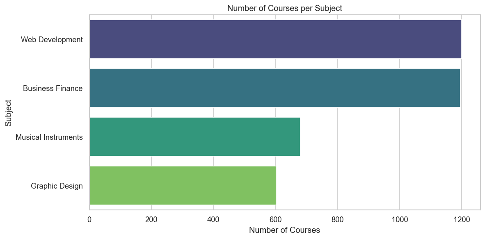
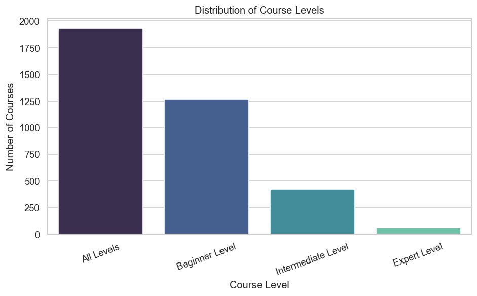
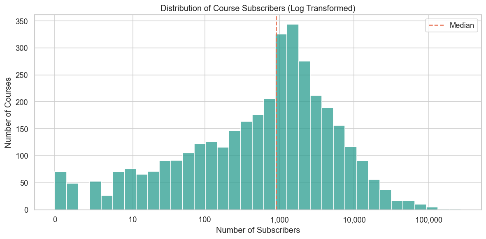
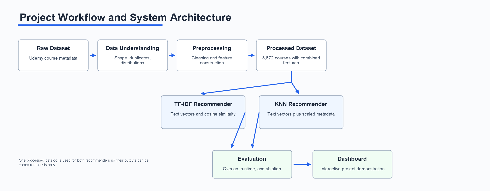
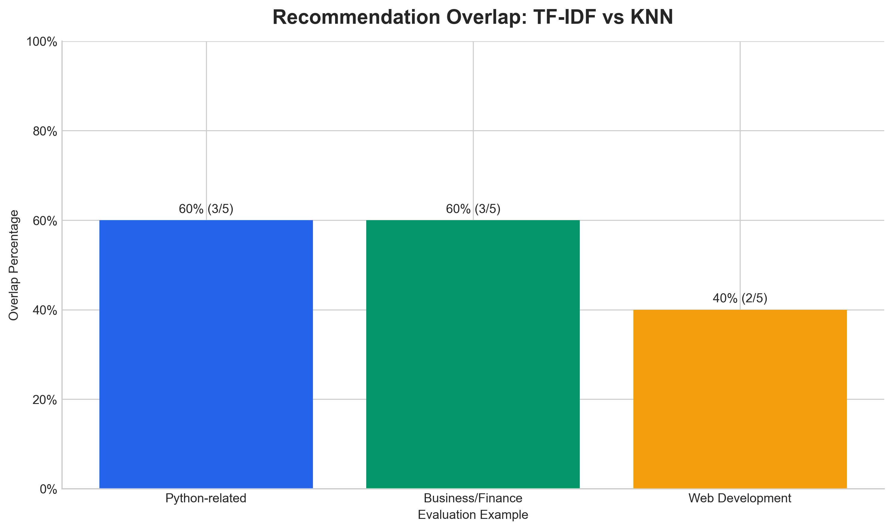
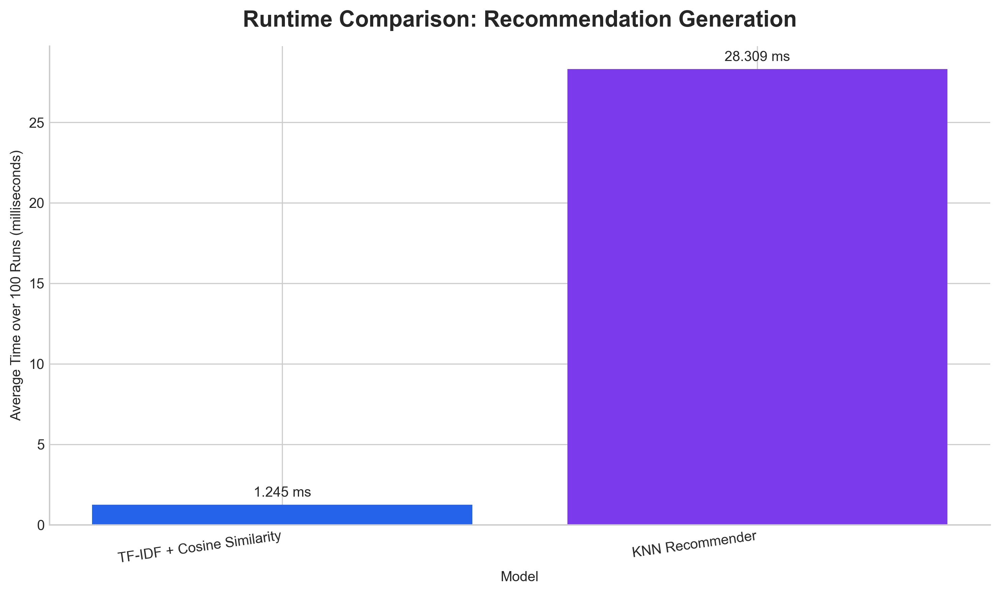
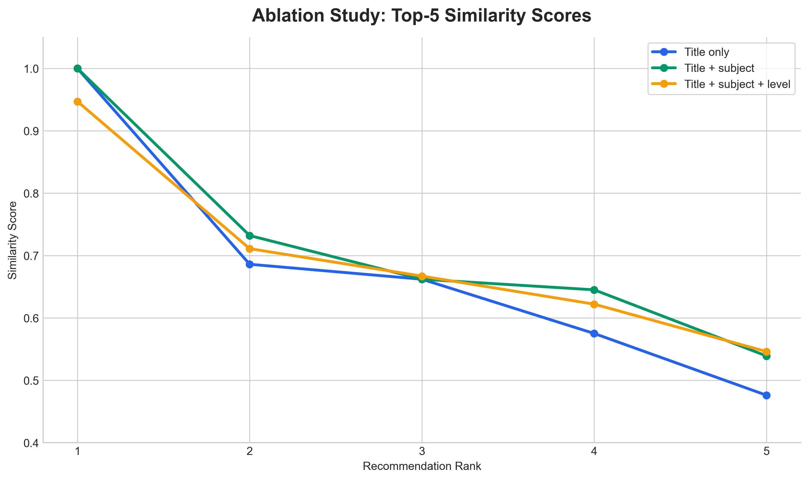
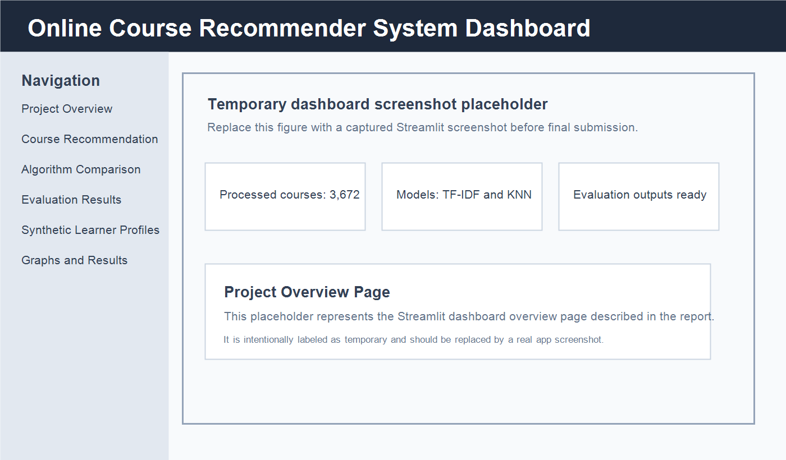

# Abstract

This project develops a content-based recommendation system for online courses using the Udemy course dataset. The problem is to recommend courses that are similar to a selected course when no user interaction data, ratings, clicks, enrollments, or purchase histories are available. Because collaborative filtering requires user behavior data, this project focuses on item metadata and textual course information.

Two recommendation approaches were implemented and compared. The first model uses TF-IDF vectorization and cosine similarity on a processed text representation called `combined_features`. The second model uses a KNN content-based approach that combines TF-IDF text features with scaled numeric course metadata. The final system also includes an evaluation notebook, exported evaluation results, synthetic learner personas for demonstration, and a Streamlit dashboard.

The processed dataset contains 3,672 courses after removing duplicate rows from the raw dataset. The evaluation shows that TF-IDF produced highly focused and interpretable recommendations and was faster during recommendation generation. KNN also produced relevant recommendations but sometimes introduced more variation because it included numeric metadata. Since the dataset does not contain ground-truth user relevance labels, standard supervised metrics such as accuracy, precision, recall, and F1 score are not directly applicable. Instead, the project evaluates recommendation relevance, overlap, runtime, and feature ablation.

# Introduction

Recommendation systems are one of the most familiar applications of machine learning because they help people navigate large collections of content. They appear in streaming services, online stores, social platforms, and learning platforms. In each case, the general goal is similar: reduce the amount of manual searching a user must do and bring relevant items closer to the surface.

## Problem

Online learning platforms contain large catalogs of courses. A learner may select one course and expect the system to suggest related alternatives. The main recommendation problem in this project is:

> Given a selected course, recommend five other courses that are most similar based on course content and metadata.

The project starts from an important initial condition: the dataset contains course-level information but does not contain user interaction records. There are no user IDs linked to enrollments, ratings, clicks, watch time, or purchases. Because of this, the system cannot learn user-to-user or item-to-item behavior patterns in the collaborative filtering sense. The correct approach for this dataset is content-based recommendation.

Content-based recommendation compares items using their own attributes. In this project, courses are represented by information such as title, subject, level, subscribers, reviews, price, content duration, and a combined text feature. The recommender then identifies courses with similar representations.

## Why We Selected This Project

We selected this project because recommendation systems are widely used in practical machine learning, but many student projects focus on familiar domains such as movies, music, books, or products. Online course recommendation gave us a slightly different setting while still using the same important recommender-system ideas.

Educational platforms such as Udemy, Coursera, and LinkedIn Learning contain thousands of learning resources. A learner who wants to build a new skill may not know which course matches their interests, background, or current skill level. Even when search is available, the number of possible choices can make discovery difficult. A recommendation system can support the learning experience by suggesting courses that are related to what a learner is already viewing and by helping users find relevant educational content more efficiently.

## Project Objectives

The main objectives were:

- understand and preprocess the Udemy course dataset;
- build a TF-IDF and cosine similarity recommender;
- build a KNN content-based recommender;
- compare the two approaches using actual recommendation outputs;
- evaluate overlap, runtime, and feature ablation;
- create synthetic learner profiles for interface demonstration only;
- present the final system in a Streamlit dashboard.

The final application does not implement collaborative filtering. Synthetic users are used only to demonstrate how learner profiles could appear in a user interface.

## Project Contribution and Unique Selling Proposition

The main contribution of this project is that it studies recommendation when only course metadata is available. Many recommendation projects depend on ratings, clicks, purchases, or other user interaction histories. The Udemy dataset used here does not provide that kind of information, so the project demonstrates how useful recommendations can still be generated from course information alone.

Instead of implementing only one content-based method, we compare two approaches: a TF-IDF and cosine similarity recommender, and a KNN recommender that combines text features with scaled numeric metadata. We evaluate the approaches through recommendation overlap, runtime comparison, and feature ablation rather than claiming supervised accuracy scores that the dataset cannot support. The final Streamlit dashboard also makes the project easier to demonstrate, and the synthetic learner personas show how personalization could be integrated in a future system if real learner data became available.

# Related Work

## Content-Based Recommendation Systems

Content-based recommendation systems compare items using their own attributes, such as titles, categories, descriptions, tags, or metadata. They are useful when user behavior data is unavailable and are usually easy to explain. Their weakness is that they may recommend items that are very similar in wording and may miss useful alternatives described with different terms.

## Collaborative Filtering

Collaborative filtering recommends items from user behavior patterns, such as ratings, clicks, enrollments, or purchases. It can capture preferences that item descriptions alone do not show, but it requires interaction data. Since this dataset has no user IDs or user-course histories, collaborative filtering could not be applied directly.

## Hybrid Recommendation Systems

Hybrid systems combine multiple recommendation strategies, often using both item metadata and user interaction data. They can balance the interpretability of content-based methods with the preference-learning ability of collaborative filtering. In this project, a full hybrid system was not possible because the required user behavior data was missing.

For this reason, the project uses content-based methods. TF-IDF and KNN both allow recommendations to be generated from course metadata alone, which matches the structure and limitations of the Udemy dataset.

# Dataset

## Choice of Dataset

The project uses a Udemy courses dataset because it contains real course metadata that is suitable for content-based recommendation. The dataset includes text fields, categorical fields, and numeric course attributes. This makes it useful for comparing a pure text similarity model with a KNN model that also incorporates numeric metadata.

## Why the Udemy Dataset

The Udemy dataset was appropriate for this project because it contains rich metadata about each course, including course title, subject, level, duration, number of reviews, number of subscribers, and price. These fields provide enough information to describe a course even though the dataset does not contain user ratings or user interaction histories.

This limitation made the project more interesting. Many recommender datasets include user-item ratings or behavior logs, which make collaborative filtering possible. In this case, recommendations had to be generated using course information alone. The dataset therefore provided a good environment for studying content-based recommendation methods and for comparing how different feature choices affect the recommended courses.

The raw dataset is located at `data/raw/udemy_courses.csv`. It contains 3,678 rows and 12 columns:

| Column | Description |
|---|---|
| `course_id` | Course identifier |
| `course_title` | Course title |
| `url` | Course URL |
| `is_paid` | Paid/free flag |
| `price` | Course price |
| `num_subscribers` | Number of subscribers |
| `num_reviews` | Number of reviews |
| `num_lectures` | Number of lectures |
| `level` | Course difficulty level |
| `content_duration` | Course duration |
| `published_timestamp` | Publication timestamp |
| `subject` | Course subject/category |

The raw data contained no missing values in these columns, but it contained 6 duplicate rows. After preprocessing, the final processed dataset contains 3,672 rows and 9 columns.

## Processed Dataset

The processed dataset is saved as `data/processed/processed_udemy_courses.csv`. It contains the columns used by the recommendation notebooks and the dashboard:

| Processed Column | Role in Project |
|---|---|
| `course_id` | Course identifier |
| `course_title` | Main text signal for recommendations |
| `subject` | Category signal |
| `level` | Difficulty signal |
| `num_subscribers` | Numeric popularity metadata |
| `num_reviews` | Numeric engagement metadata |
| `price` | Numeric course metadata |
| `content_duration` | Numeric course length metadata |
| `combined_features` | Text representation used for TF-IDF vectorization |

The processed dataset has no missing values in `combined_features`. There are still duplicate course titles in the processed data, but not duplicate rows. When multiple courses share the same title, the implemented system uses the first matching course entry.

# Exploratory Data Analysis

The data understanding notebook examined dataset shape, columns, missing values, duplicate rows, and major distributions. The subject distribution shows that the dataset covers four main subject areas: Web Development, Business Finance, Musical Instruments, and Graphic Design.

::: {layout-ncol=2}
{#fig-subjects width=100%}

{#fig-levels width=100%}
:::

The final processed subject counts are:

| Subject | Number of Courses |
|---|---:|
| Web Development | 1,199 |
| Business Finance | 1,191 |
| Musical Instruments | 680 |
| Graphic Design | 602 |

The course level distribution shows that most courses are labeled either "all levels" or "beginner level". This is important for recommendation because level can help distinguish introductory courses from more advanced courses.

The final processed level counts are:

| Course Level | Number of Courses |
|---|---:|
| All Levels | 1,925 |
| Beginner Level | 1,268 |
| Intermediate Level | 421 |
| Expert Level | 58 |

The subscriber distribution is highly skewed. Most courses have relatively low subscriber counts, while a small number of courses have very high subscriber counts. In the processed dataset, the median number of subscribers is 912, while the maximum is 268,923.

{#fig-subscribers width=62%}

This skew matters because popularity metadata can strongly influence models that include numeric features. For this reason, numeric features in the KNN model are scaled before they are combined with TF-IDF text features.

# Preprocessing

The preprocessing notebook prepared the dataset for recommendation modeling. The main steps were:

1. load the raw Udemy dataset;
2. select the columns relevant to recommendation;
3. clean text fields such as course titles, subject names, and levels;
4. handle missing values;
5. remove duplicate rows;
6. create `combined_features`;
7. save the processed dataset.

The most important preprocessing output is the `combined_features` column. This column combines text fields such as course title, subject, and level into one representation. It allows text vectorizers to treat multiple course attributes as a single document.

The raw dataset had 3,678 rows. After removing 6 duplicate rows, the processed dataset had 3,672 rows. The processed data is the shared input for the TF-IDF notebook, the KNN notebook, the evaluation notebook, and the dashboard. This consistency is important because model comparisons should use the same course catalog and feature base.

The overall project workflow is shown in Figure @fig-workflow. It starts with the raw dataset and moves through data understanding, preprocessing, recommender construction, evaluation, and dashboard presentation. This helped keep the notebooks and dashboard connected to the same processed data.

{#fig-workflow width=82%}

# TF-IDF Content-Based Recommender

## How TF-IDF Works

The TF-IDF recommender uses the `combined_features` text column to represent every course as a numeric vector. This column combines the course title, subject, and level, so the model uses both the topic of the course and the general learning context. TF-IDF stands for Term Frequency and Inverse Document Frequency.

Term Frequency measures how often a term appears in a course's text representation. A word that appears in a course title or combined feature receives more importance for that course.

Inverse Document Frequency reduces the importance of words that appear too frequently across many courses. Very common words are less useful for distinguishing courses from one another.

Together, TF-IDF creates vectors that give higher weight to terms that are important for a specific course but not common across the entire dataset. This is useful for course recommendation because terms such as "python", "investment banking", "javascript", or "photoshop" can identify topic similarity.

## Cosine Similarity

After TF-IDF vectorization, cosine similarity is used to compare course vectors. Cosine similarity measures the angle between two vectors rather than their raw magnitude. This makes it suitable for text data because two courses can be similar even if their text lengths differ.

The TF-IDF notebook computes a course-by-course cosine similarity matrix. For a selected course, the recommender retrieves similarity scores, removes the selected course itself, sorts the remaining courses by similarity, and returns the top five recommendations.

## Computation

The TF-IDF computation can be summarized as:

1. transform `combined_features` into a TF-IDF matrix;
2. compute cosine similarity between all course vectors;
3. find the row corresponding to the selected course;
4. sort similarity scores from highest to lowest;
5. remove the selected course;
6. return the top five most similar courses.

This model is the baseline recommendation model for the project. It is simple, interpretable, and works without user interaction data.

## Reason for Using TF-IDF

TF-IDF was selected because it fits the structure of the dataset. Course titles and metadata contain meaningful words, and the project needed a method that could compare courses without ratings or learner histories. It also provides recommendations that are relatively easy to explain: if two courses share distinctive terms, their similarity score increases.

# KNN Content-Based Recommender

## How KNN Works

The KNN recommender treats each course as a point in a feature space. For a selected course, it finds the nearest neighboring courses using cosine distance. Courses with smaller cosine distance are considered more similar.

The KNN model uses text features from `combined_features` and numeric metadata when available. The numeric features include course subscribers, reviews, price, and content duration. These numeric values are scaled before being combined with text features, because they have different ranges and units. In practical terms, this means that a course is compared not only by its words but also by selected course characteristics.

## KNN Similarity Score

KNN returns cosine distance. The displayed KNN similarity score is calculated as:

$$
\text{similarity} = 1 - \text{cosine distance}
$$

This means a higher displayed score represents a closer neighbor. It should be interpreted as a KNN-derived similarity score, not as exactly the same value as the TF-IDF cosine similarity score.

## Computation

The KNN computation can be summarized as:

1. vectorize `combined_features` using TF-IDF;
2. scale numeric metadata;
3. combine text and numeric features into one feature matrix;
4. fit a nearest-neighbor model using cosine distance;
5. query the nearest neighbors for the selected course;
6. remove the selected course itself;
7. return the top five recommendations.

KNN is useful because it can include more than text. However, it is more computationally expensive during recommendation generation than the TF-IDF similarity lookup used in this project.

## Reason for Using KNN

KNN was selected as a second content-based approach because it allowed us to test whether adding numeric metadata would change the recommendation behavior. This made the comparison more meaningful than using two text-only methods. It also reflects a realistic design question for recommender systems: whether popularity, reviews, price, and duration should influence course similarity alongside topic wording.

# Evaluation

## Evaluation Methodology

The dataset does not include user interaction data or ground-truth relevance labels. Therefore, classification-style metrics such as accuracy, precision, recall, and F1 score are not directly applicable. A prediction cannot be marked correct or incorrect against a known user preference label because no such labels exist.

Instead, the evaluation focuses on:

- recommendation relevance by inspecting generated recommendations;
- recommendation overlap between TF-IDF and KNN;
- runtime performance;
- feature ablation;
- qualitative strengths and limitations.

This is appropriate for the initial condition of the program: a content-based recommender built from course metadata only.

## Recommendation Examples

The evaluation notebook used three representative input courses:

| Category | Input Course |
|---|---|
| Python-related | web programming with python |
| Business/Finance | ultimate investment banking course |
| Web Development | learn complete web development from scratch |

For the Python-related course, both models recommended `python web programming` as the top recommendation. TF-IDF also recommended several Python-specific courses such as `python for beginners python programming language tutorial` and `complete python web course build 8 python web apps`. KNN recommended some overlapping Python courses, but also introduced broader web development courses such as `learn html5 programming from scratch`.

For the Business/Finance example, both models recommended strongly related investment banking courses. Shared recommendations included `the complete investment banking course 2017`, `advanced accounting for investment banking`, and `the investment banking recruitment series`.

For the Web Development example, TF-IDF strongly favored courses containing terms such as "web development" and "from scratch". KNN included relevant but more varied web development recommendations.

## Recommendation Overlap

The overlap analysis compares how many of the top five recommendations are shared by TF-IDF and KNN for each example course.

| Evaluation Category | Common Recommendations | Overlap |
|---|---:|---:|
| Python-related | 3 | 60% |
| Business/Finance | 3 | 60% |
| Web Development | 2 | 40% |

{#fig-overlap width=62%}

The overlap results show that the two models often agree on the core topic of the selected course. The Python-related and Business/Finance examples both had 60% overlap, meaning that three of the top five recommendations were shared. This suggests that the strongest topic signals were recognized by both approaches.

The Web Development example had lower overlap at 40%. This does not mean that one model failed. It shows that the two approaches were using the available information differently. TF-IDF stayed closer to the wording of the selected course, while KNN could introduce more varied alternatives because it also considered numeric metadata. In a real course discovery setting, this difference could be useful: TF-IDF may be better when a learner wants very close matches, while KNN may be better when some variation is acceptable.

## Runtime Comparison

The runtime comparison used the same test course, `web programming with python`, and averaged recommendation generation time over 100 runs.

| Model | Recommendation Generation Time |
|---|---:|
| TF-IDF + Cosine Similarity | 0.001245 seconds |
| KNN Recommender | 0.028309 seconds |

{#fig-runtime width=62%}

TF-IDF was faster in this experiment, with an average generation time of 0.001245 seconds compared with 0.028309 seconds for KNN. The difference is expected because the TF-IDF approach can look up precomputed cosine similarities, while KNN searches for nearest neighbors from the feature representation at recommendation time.

KNN was slower, but it was still practical for the dataset size of 3,672 courses. These values are environment-dependent, so they should be interpreted as a relative comparison rather than fixed production benchmarks. For this project, both methods were fast enough to support dashboard demonstration.

# Ablation Study

The ablation study tested how different feature combinations affect recommendation behavior for the input course `web programming with python`.

The three experiments were:

| Experiment | Feature Combination | Observation |
|---|---|---|
| A | course title only | Relevant results because the title contains strong keywords: web, programming, and python. |
| B | course title + subject | Same top-five set, with subject reinforcing Web Development relevance. |
| C | course title + subject + level | Focused results with added difficulty context; selected as the final text representation. |

{#fig-ablation width=72%}

The ablation study shows that course title is the strongest text feature for this example because it contains distinctive words. In the test course `web programming with python`, the words "web", "programming", and "python" already provide strong signals, so title-only recommendations were still relevant.

Adding subject improved category relevance by reinforcing that the course belongs to Web Development. Adding level added difficulty context, which is helpful when two courses are similar in topic but intended for different learners. The final recommended feature combination is `course_title + subject + level`, consistent with the use of `combined_features` in the project.

# Synthetic Users

The project includes `data/synthetic_users.csv`, which contains eight synthetic learner personas:

1. Beginner Python Learner
2. Data Science Learner
3. Business / Finance Professional
4. Web Developer
5. Photographer
6. Music Learner
7. Graphic Design Learner
8. Entrepreneur

These profiles are not real users. They are not used for collaborative filtering. They are only sample learner profiles for demonstrating personalization in the dashboard interface.

The persona recommendation mode uses simple content matching between persona interests and course fields such as title, subject, level, and `combined_features`. For the photography persona, the dashboard labels the area as "Photography / Photo Editing" because the dataset mainly contains Photoshop, photo-editing, and graphic-design related courses rather than pure photography course titles.

# Dashboard

The final Streamlit dashboard is implemented in `app.py`. It provides a presentation-ready interface for exploring the project outputs.

The dashboard includes six main pages. Together, they turn the notebooks and result files into an interface that can be demonstrated without manually opening each artifact.

{#fig-dashboard width=88%}

The **Project Overview** page summarizes the purpose of the system, the dataset size, and the main components of the workflow. It gives a quick entry point for someone who has not read the notebooks.

The **Course Recommendation** page is the main interactive part of the dashboard. A user can select or type a course title and generate top-five recommendations using TF-IDF, KNN, or both models side by side. This page demonstrates the actual recommendation behavior of the system.

The **Algorithm Comparison** page uses saved recommendation examples from the evaluation notebook. It compares TF-IDF and KNN outputs for representative input courses and shows where the two methods agree.

The **Evaluation Results** page presents the exported overlap, runtime, ablation, and summary results. This helps connect the dashboard demonstration to the project evaluation rather than showing recommendations without evidence.

The **Synthetic Learner Profiles** page uses the synthetic personas to demonstrate how a future learning platform could present profile-based course discovery. These profiles are not real user histories and are not used for collaborative filtering.

The **Graphs and Results** page displays the exported graphs from the notebooks, including dataset distributions and evaluation visuals. This page makes the visual results easier to browse during presentation.

The app uses real project files where available. The processed course catalog supplies the recommendation input, the synthetic user file supports the persona demonstration, the saved recommendation examples support the algorithm comparison page, and the exported evaluation and graph folders provide the tables and figures shown in the dashboard.

The dashboard also handles important input cases. It supports exact and partial course title matching, strips whitespace, lowercases input, warns on empty input, and explains that duplicate titles use the first matching course entry. The KNN sparse matrix is converted to CSR format so that row indexing works correctly during recommendation generation.

# Limitations

## Accuracy and Precision

The project does not report accuracy, precision, recall, or F1 score as final model metrics because these metrics require known relevant and non-relevant items. The dataset does not contain user feedback or labels that identify whether a recommendation was correct for a specific learner.

Instead, the evaluation uses qualitative relevance checks, overlap, runtime, and ablation. This is a limitation, but it is also the correct interpretation of the available data.

## Content Dependence

The recommenders depend on available course text and metadata. If a course title or combined feature text is too short, unclear, or missing important terms, the recommendation quality may decrease.

## Similarity Bias

TF-IDF can over-recommend courses with very similar wording. This makes recommendations interpretable, but it may reduce variety. KNN can introduce more variation through numeric metadata, but numeric features may also influence the results in ways that are less directly interpretable.

## Scalability

The project dataset is small enough for the implemented methods to work efficiently. For much larger course catalogs, sparse matrix techniques, approximate nearest-neighbor search, or indexed retrieval systems would be more appropriate.

## No User Behavior

The system cannot personalize recommendations based on real learner history because user interaction data is not available. Synthetic personas demonstrate interface behavior only and should not be interpreted as learned user preferences.

# Conclusion

This project successfully builds and evaluates a content-based online course recommender system using real Udemy course metadata. The processed dataset contains 3,672 courses after duplicate-row removal and includes a complete `combined_features` column for recommendation modeling.

The TF-IDF recommender serves as the baseline model. It converts course text into numerical vectors and uses cosine similarity to retrieve the most similar courses. It produced focused and interpretable recommendations and had the fastest recommendation generation time in the evaluation.

The KNN recommender uses TF-IDF text features together with scaled numeric metadata. It also produced relevant recommendations and sometimes introduced more diverse alternatives. Its displayed similarity score is calculated as `1 - cosine distance`.

The evaluation found that TF-IDF and KNN shared 60% overlap for the Python example, 60% overlap for the Business/Finance example, and 40% overlap for the Web Development example. TF-IDF averaged 0.001245 seconds for recommendation generation, while KNN averaged 0.028309 seconds for the same test course over 100 runs. Both runtimes are practical for this dataset size.

The ablation study showed that course title alone can be strong when it contains distinctive keywords, but adding subject and level improves category relevance and difficulty context. The final recommended feature representation is `course_title + subject + level`, matching the project's use of `combined_features`.

Overall, the project achieved a complete recommender-system workflow: data understanding, preprocessing, TF-IDF recommendation, KNN recommendation, evaluation, synthetic persona demonstration, exported results, and a final dashboard. The system is appropriate for a dataset without user interaction data and provides a clear foundation for future work if real user behavior becomes available.
